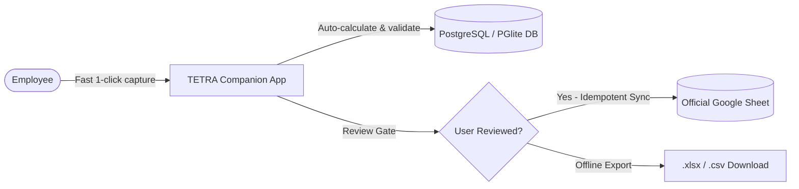
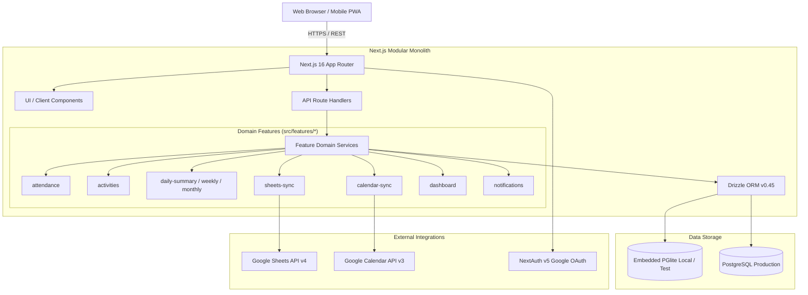
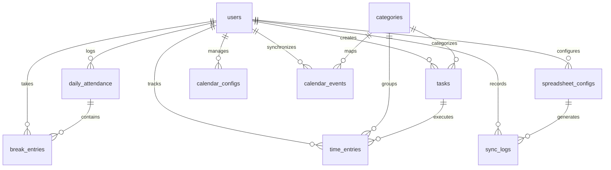
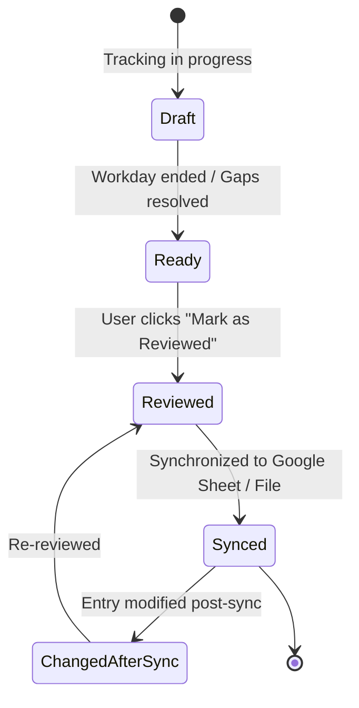

# TETRA Companion App — Comprehensive System & Feature Documentation

> **TETRA** is a lightweight employee task and time tracking companion application.  
> Its core mission is to minimize the daily friction of tracking work, automatically compute durations and category allocations, and reliably synchronize reviewed results to the organization's official Google Sheet report without manual spreadsheet data entry.

---

## Table of Contents

1. [Overview & Core Mission](#1-overview--core-mission)
2. [System Architecture & Technology Stack](#2-system-architecture--technology-stack)
3. [Domain Data Model & Database Schema](#3-domain-data-model--database-schema)
4. [Standard Work Categories & Theming](#4-standard-work-categories--theming)
5. [Complete Feature Catalog](#5-complete-feature-catalog)
   - [5.1 Attendance Tracking & Workday Lifecycle](#51-attendance-tracking--workday-lifecycle)
   - [5.2 Live Activity Timer & Fast Switching](#52-live-activity-timer--fast-switching)
   - [5.3 Task Management & Kanban Board](#53-task-management--kanban-board)
   - [5.4 Interactive Timeline, Gap Filling & Splitting](#54-interactive-timeline-gap-filling--splitting)
   - [5.5 Daily Review & Verification Gate](#55-daily-review--verification-gate)
   - [5.6 Google Sheets Synchronization Engine](#56-google-sheets-synchronization-engine)
   - [5.7 Executive Dashboard & Target Tracking](#57-executive-dashboard--target-tracking)
   - [5.8 Google Calendar Two-Way Integration](#58-google-calendar-two-way-integration)
   - [5.9 Companion Alerts & Intelligent Notifications](#59-companion-alerts--intelligent-notifications)
   - [5.10 Keyboard Shortcuts, PWA & Guided Tour](#510-keyboard-shortcuts-pwa--guided-tour)
6. [API Architecture & Endpoint Reference](#6-api-architecture--endpoint-reference)
7. [Environment Configuration & Database Runtime](#7-environment-configuration--database-runtime)
8. [Testing, Verification & Quality Assurance](#8-testing-verification--quality-assurance)

---

## 1. Overview & Core Mission

### Why TETRA Exists
The official employee task and time tracking report is maintained in a centralized Google Spreadsheet. Manually reconstructing hours at the end of every working day—calculating exact `IN`, `BREAK`, and `OUT` times, splitting hours across eight separate categories, and formatting notes—is tedious, error-prone, and causes end-of-day administrative fatigue.

**TETRA is an operational companion, never a spreadsheet replacement.**



### Core Product Principles
1. **Google Sheet is the Official Record**: The spreadsheet remains the authoritative corporate artifact; TETRA serves as the streamlined data collector and calculation engine ([ADR 0001](file:///home/noah/project/tetra/docs/adr/0001-keep-google-sheet-official.md)).
2. **PostgreSQL is the Local Source of Truth**: All raw activities, attendances, and logs are persisted in an ACID-compliant database ([ADR 0003](file:///home/noah/project/tetra/docs/adr/0003-app-db-source.md)).
3. **Explicit Review Before Synchronization**: No data is silently pushed to the official sheet without an explicit user review step ([ADR 0004](file:///home/noah/project/tetra/docs/adr/0004-explicit-sync.md)).
4. **Server-Side Truth for Time**: Timestamps are stored in UTC; durations and boundary checks are calculated strictly server-side ([ADR 0007](file:///home/noah/project/tetra/docs/adr/0007-utc-time.md)).
5. **No Surveillance**: No background screen-recording, invasive activity monitoring, or silent time fabrication.
6. **Zero-Friction Interactions**: Start, stop, and switch tasks in seconds via keyboard shortcuts or 1-tap touch actions.

---

## 2. System Architecture & Technology Stack

TETRA is implemented as a **modular monolith** ([ADR 0002](file:///home/noah/project/tetra/docs/adr/0002-modular-monolith.md)) using Next.js 16 with the App Router, separating pure business logic domain services from React Server and Client Components.



### Stack Breakdown
- **Frontend Framework**: [Next.js 16.3.4](file:///home/noah/project/tetra/package.json#L29) (App Router), [React 19.2.8](file:///home/noah/project/tetra/package.json#L34), React Compiler.
- **Language**: [TypeScript 5](file:///home/noah/project/tetra/package.json#L54) (Strict mode enabled, no `any`).
- **Styling & UI Kit**: [Tailwind CSS v4](file:///home/noah/project/tetra/package.json#L52), [shadcn/ui](file:///home/noah/project/tetra/package.json#L36), Radix UI primitives, Lucide Icons.
- **Database & ORM**: [Drizzle ORM 0.45.2](file:///home/noah/project/tetra/package.json#L25) with a dual runtime:
  - Local / Tests / Dev: Embedded [@electric-sql/pglite](file:///home/noah/project/tetra/src/server/db/index.ts#L3) (zero external database setup required, [ADR 0008](file:///home/noah/project/tetra/docs/adr/0008-embedded-pglite.md)).
  - Production / Cloud: [Postgres.js](file:///home/noah/project/tetra/src/server/db/index.ts#L6) connection pooling.
- **Authentication**: [NextAuth.js v5](file:///home/noah/project/tetra/src/server/auth.ts) supporting Google OAuth (with offline refresh tokens and scopes for Google Sheets and Google Calendar) plus a local developer mock credentials provider.
- **Validation**: [Zod 4.5.4](file:///home/noah/project/tetra/package.json#L40) for all API payloads and environment variables ([`env.ts`](file:///home/noah/project/tetra/src/server/env.ts)).
- **Spreadsheet & File Processing**: [Google APIs v178](file:///home/noah/project/tetra/package.json#L27) (`googleapis`), [ExcelJS 4.4.0](file:///home/noah/project/tetra/package.json#L26) for file-based `.xlsx` manipulation.
- **Testing**: [Vitest 3.2.0](file:///home/noah/project/tetra/package.json#L55) for unit/integration/adversarial suites, [Playwright 1.55.0](file:///home/noah/project/tetra/package.json#L43) for end-to-end browser tests.

---

## 3. Domain Data Model & Database Schema

The database schema is defined in [`src/server/db/schema.ts`](file:///home/noah/project/tetra/src/server/db/schema.ts).



### Primary Tables & Enums

| Table / Enum | Key Fields | Purpose |
|---|---|---|
| [`users`](file:///home/noah/project/tetra/src/server/db/schema.ts#L38-L54) | `id`, `email`, `name`, `timezone`, `googleAccessToken`, `googleRefreshToken`, `googleTokenExpiresAt` | User account with OAuth credentials and default IANA timezone. |
| [`categories`](file:///home/noah/project/tetra/src/server/db/schema.ts#L56-L61) | `id`, `key` (unique), `name`, `sortOrder` | System-wide official work category definitions. |
| [`tasks`](file:///home/noah/project/tetra/src/server/db/schema.ts#L63-L83) | `id`, `userId`, `name`, `categoryId`, `status` (`todo`, `in_progress`, `done`), `isFavorite`, `lastUsedAt` | Task entities created or worked on by users. |
| [`daily_attendance`](file:///home/noah/project/tetra/src/server/db/schema.ts#L85-L115) | `id`, `userId`, `workDate`, `clockInAt`, `clockOutAt`, `status` (`open`, `closed`), `reviewState` (`draft`, `ready`, `reviewed`, `synced`, `changed_after_sync`), `reviewedAt`, `lastSyncedAt` | Daily attendance record containing workday start/end times and verification status. |
| [`break_entries`](file:///home/noah/project/tetra/src/server/db/schema.ts#L117-L132) | `id`, `userId`, `attendanceId`, `startedAt`, `endedAt` | Specific break spans taken during an open attendance. |
| [`time_entries`](file:///home/noah/project/tetra/src/server/db/schema.ts#L134-L160) | `id`, `userId`, `taskId`, `categoryId`, `startedAt`, `endedAt`, `status` (`active`, `paused`, `completed`), `pausedSeconds`, `notes`, `source` (`timer`, `manual`) | Granular logged activity spans with notes and paused intervals. |
| [`spreadsheet_configs`](file:///home/noah/project/tetra/src/server/db/schema.ts#L162-L179) | `id`, `userId`, `spreadsheetId`, `worksheetName`, `sheetGid`, `mapping` (JSONB), `timezone`, `active` | Coordinate mappings between TETRA fields and Google Sheet columns. |
| [`sync_logs`](file:///home/noah/project/tetra/src/server/db/schema.ts#L181-L198) | `id`, `userId`, `workDate`, `spreadsheetConfigId`, `status` (`pending`, `success`, `failed`), `payloadHash`, `changedCells` (JSONB), `errorMessage` | Audit log of every synchronization attempt and exact cells modified. |
| [`calendar_configs`](file:///home/noah/project/tetra/src/server/db/schema.ts#L200-L216) | `id`, `userId`, `calendarId`, `calendarName`, `syncEnabled`, `categoryRules` (JSONB), `lastSyncAt` | User settings for Google Calendar sync and auto-categorization rules. |
| [`calendar_events`](file:///home/noah/project/tetra/src/server/db/schema.ts#L218-L251) | `id`, `userId`, `googleEventId`, `title`, `description`, `categoryId`, `startAt`, `endAt`, `allDay`, `meetUrl`, `guests` (JSONB), `sendUpdates` | Cached/synchronized Google Calendar events with category predictions. |

---

## 4. Standard Work Categories & Theming

TETRA standardizes tracking across eight corporate categories defined in [`src/lib/categories.ts`](file:///home/noah/project/tetra/src/lib/categories.ts). Each category features an intentional color identity, badge tokens, border accents, and Lucide icons:

| Category Key | Display Name | Short Label | Accent Color | Hex | Default Sheet Column |
|---|---|---|---|---|---|
| `website_management` | Website Management | Website | Emerald | `#10b981` | `EL` |
| `cyber_security` | Cyber Security | Security | Rose | `#f43f5e` | `EN` |
| `technology_innovation` | Technology Optimization & Innovation | Tech & Innovation | Violet | `#8b5cf6` | `EP` |
| `infrastructure_management` | Infrastructure Management | Infrastructure | Blue | `#3b82f6` | `ER` |
| `research` | Research | Research | Amber | `#f59e0b` | `FL` |
| `meeting` | Meeting | Meeting | Sky | `#0ea5e9` | `FN` |
| `training` | Training | Training | Orange | `#f97316` | `FP` |
| `other_tasks` | Other Tasks | Other | Slate | `#94a3b8` | `FR` |

---

## 5. Complete Feature Catalog

### 5.1 Attendance Tracking & Workday Lifecycle
Implemented in [`src/features/attendance/`](file:///home/noah/project/tetra/src/features/attendance/) and presented via the [Today Screen](file:///home/noah/project/tetra/src/components/today/today-screen.tsx), composed of `ActiveTaskCard`, `EmptyStateCard`, `TodayOverviewPanel`, `StopTaskConfirmDialog` and `StopWorkConfirmDialog` plus the `useTodayGuards` hook (unload prompt while working, plus desktop alerts for long tasks and extended breaks), each in its own module under [`src/components/today/`](file:///home/noah/project/tetra/src/components/today/).

- **Clock In / Clock Out**:
  - `POST /api/attendance/start`: Opens daily attendance with a UTC timestamp.
  - `POST /api/attendance/stop`: Closes attendance; automatically stops any currently running activity timer and active break.
- **Break Management**:
  - `POST /api/breaks/start`: Pauses work and opens a break span.
  - `POST /api/breaks/stop`: Ends the active break.
- **Auto Clock-In on Task Launch**: If an employee starts a timer or logs an activity before clocking in, TETRA automatically creates and clocks into attendance at the task's start time, eliminating manual pre-steps.
- **End Break & Resume**: One-click action on the break card that simultaneously ends the active break and resumes the previously paused task timer.
- **Boundary Auto-Expansion**: If a user logs a manual time entry or imports a calendar event that starts before `clockInAt` or ends after `clockOutAt`, the system automatically adjusts the attendance boundaries to encompass the work.

---

### 5.2 Live Activity Timer & Fast Switching
Implemented in [`src/features/activities/`](file:///home/noah/project/tetra/src/features/activities/) and [`src/components/today/`](file:///home/noah/project/tetra/src/components/today/).

- **Precision Stopwatch**: Real-time ticker with `HH:MM:SS` display based on server timestamps; immune to client tab throttling.
- **Pause & Resume**: Pause a running task with accumulated duration tracked in `pausedSeconds`.
- **1-Tap Task Switcher**: Switcher dialog (`SwitchTaskDialog`) accessible directly from the active timer card to seamlessly stop the current task and launch a new one without losing context.
- **Quick-Start Favorites**: Pin favorite tasks with star badges for immediate one-click timer starts.
- **Sticky Task Bar**: Mobile-only floating controller (`StickyTaskBar`, hidden from `md` up) that appears only once the active task card has scrolled under the sticky header (`useOutOfView`, IntersectionObserver-driven). It shows the task name, live elapsed time, and pause/resume and stop actions.
- **Today Action Hierarchy**: The active card keeps the primary controls (Pause/Resume, Switch Task, Stop). Day-level actions sit in one quiet row beneath it: outline `Log Activity`, ghost `Break` / `End Break & Resume <task>`, and a destructive-outline `Stop Work` aligned right. Buttons use `size="sm"` from `sm` up and an `h-11` touch height below it.
- **Daily Target Progress Card** (`TargetProgress`, `target-progress.tsx`):
  - Displays daily target progress against an 8-hour workday (480 minutes).
  - Calculates and displays real-time **Projected Wrap-Up Time** based on current pace, remaining minutes, and logged breaks.

---

### 5.3 Task Management & Kanban Board
Located at route [`/tasks`](file:///home/noah/project/tetra/src/app/(app)/tasks/page.tsx) and implemented in [`src/components/tasks/tasks-view.tsx`](file:///home/noah/project/tetra/src/components/tasks/tasks-view.tsx), which composes `TasksHeader`, `TasksFilterBar`, `KanbanBoard` (`KanbanColumn`, `TaskCard`), `TaskListView` and `TaskModalDialog` (`task-dialog.tsx`). State lives in the `useTasksState` and `useKanbanState` hooks; filtering, sorting, grouping and stats are pure functions in `task-filters.ts`, and shared constants are in `task-constants.ts`.

- **Dual View Modes**:
  - **Kanban Board**: Drag-and-drop task cards across columns: `To Do`, `In Progress`, and `Done`.
  - **List View**: Dense tabular listing with sortable headers.
- **Direct Timer Trigger**: Play button on every task card to immediately start tracking that task.
- **Favorites & Search**: Real-time text search plus quick filters (All, Due Today, Overdue, Favorites).
- **Filter Bar & Filters Sheet**: On `md` and up, a single filter row holds the search box, quick-filter pills, category select, sort select and hide-done toggle. Below `md`, only search and a `Filters` button remain; the button shows an active-filter count and opens a bottom sheet with the same controls plus `Clear filters`.
- **View Menu**: A `View` menu (all widths) switches Layout (Kanban / List) and card Density; a segmented Kanban/List toggle is also shown from `md` up.
- **Task Modals**: Create, edit, and delete tasks with custom descriptions and category assignments.

---

### 5.4 Interactive Timeline, Gap Filling & Splitting
Located at route [`/timeline`](file:///home/noah/project/tetra/src/app/(app)/timeline/page.tsx) and implemented in [`src/components/timeline/timeline-view.tsx`](file:///home/noah/project/tetra/src/components/timeline/timeline-view.tsx), which composes `TimelineList` (with `TimelineEntryCard` and `TimelineBreakCard`), `DayOverviewCard` and the `DeleteEntryDialog` / `DeleteBreakDialog` pair (`timeline-delete-dialogs.tsx`). Day and category loading live in the `useTimelineDay` hook, and sorting, interleaving and gap detection are pure functions in `timeline-items.ts`.

- **Chronological Feed**: Unified chronological stream interleaving completed time entries and break spans.
- **Inline "Fill Gap" Action**: Automatically calculates gaps between consecutive items exceeding 5 minutes; provides an inline `+ Fill gap (XXm)` button that opens the entry dialog pre-populated with exact start and end times.
- **Entry Split Dialog (`SplitEntryDialog`)**: Retroactively split an uninterrupted time block into two distinct tasks with a visual time slider or timestamp inputs.
- **Granular Entry Editing & ±15m Nudges**: Edit dialog (`EntryDialog`) with quick adjustment buttons (`-15m`, `+15m`) for rapid boundary tweaking.
- **Day Navigator**: Seamless date travel with Previous/Next day buttons, interactive date picker, and quick "Today" reset.
- **Header Actions**: The Timeline header offers only **Add break** and **Add activity**. Sheet actions (Pull from Sheet, Sync to file, Sync now) live in Reports, and the auto-sync toggle lives in Settings. Background auto-sync of Timeline edits (add/edit/delete entries and breaks) is unchanged and still follows the `autoSyncTasks` setting.
- **Duration Display**: Entry and break durations use the single `formatHuman` format (`3h 15m`, `45m`); sub-minute entries and breaks show `<1m`.

---

### 5.5 Daily Review & Verification Gate
Located at route [`/reports`](file:///home/noah/project/tetra/src/app/(app)/reports/page.tsx) and implemented in [`src/components/reports/review-view.tsx`](file:///home/noah/project/tetra/src/components/reports/review-view.tsx).



- **Review & Sync Stepper (`ReviewStepper`)**: The right-hand card is a 3-step stepper with exactly one filled (primary) button, the current step's main action:
  1. **Resolve "Needs attention"**: lists warnings with a `Fix issues on Timeline` link (and `Clock out now` when clock-out is missing). Done when no blocking warnings remain.
  2. **Mark reviewed**: done once the day is reviewed or synced.
  3. **Preview, then Sync to Sheet**: `Preview` opens the sync preview; `Sync to Sheet` is never gated by step (the server owns the review/config checks).
  The step logic is the pure `computeReviewStep` helper in `review-step.ts`.
- **"More" Menu**: An ellipsis menu in the stepper header (`review-more-menu`) holds the secondary sheet actions: **Pull from Sheet**, **Sync to file** (opens `FileSyncDialog`), and **Sync now (unreviewed)** (syncs with `allowUnreviewed: true`, skipping the review gate).
- **Backfill Navigation (`BackfillNav`)**: When Reports is opened from the "Backfill N days" banner (`/reports?date=<oldest>&backfill=<d1,d2,...>`), a banner steps through the missing days with a "Next missing day" button (and a "k of N" counter while the current day is in the list).
- **Daily Aggregate Totals**: Automatic summation of Total Attendance, Total Break, Total Work, and individual category minutes.
- **Discrepancy & Gap Warnings**: Contextual alert banners for overlapping time entries, open attendance records, and large unlogged spans. A break shorter than one minute raises an informational `short_break` warning, which is shown dimmed and never blocks review (`isBlockingWarning`).
- **Review State Machine**: Strictly enforces human review before initiating synchronization. Modifying an entry on a synced day flags it as `Changed after sync`.
- **Periodic Summaries**: Tabs for Weekly Summary and Monthly Summary aggregating category distributions over broader time horizons.

---

### 5.6 Google Sheets Synchronization Engine
Implemented in [`src/features/sheets-sync/`](file:///home/noah/project/tetra/src/features/sheets-sync/).

- **Narrow Cell Writes**: Only modifies explicitly mapped cells (e.g. `B14` for Clock In, `EL14` for Website Management). Never touches unrelated rows, formulas, or formatting.
- **Compiled Category Notes**:
  - Aggregates notes from all time entries within each category into bulleted summaries.
  - Writes compiled notes to designated sheet note columns (columns `I`, `K`, `M`, `O`, `Q`, `S`, `U`, `W`).
- **Sync Preview Dialog (`SyncPreviewDialog`)**: Shows the exact A1 cell coordinates and preview values before writing. Includes an editable text area to adjust compiled notes prior to submission.
- **Idempotency & SHA-256 Hashing**: Generates a deterministic hash of target cell values. If the sheet already contains matching values, the write is safely skipped and recorded as idempotent.
- **Auto Sheet Inspection (`/api/sheets/inspect`)**: Automatically reads target Google Sheets to detect available tab names, header rows, and column positions.
- **Sync History & Retries**: Full audit log in `sync_logs` tracking timestamp, status (`pending`, `success`, `failed`), modified cells, and error messages with 1-click retry.
- **File-Based Offline Sync (`FileSyncDialog`)**: Upload an `.xlsx` or `.csv` workbook file; TETRA applies the day's calculations and returns the updated file for download without requiring Google OAuth credentials.
- **Where to trigger it**: Sync, preview, pull, file sync and unreviewed sync are all driven from the Reports stepper and its More menu; Timeline edits sync in the background when auto-sync is on.
- **Reverse Sheet Pull (`pullDayFromSheet`)**: Reconstructs TETRA attendance and time entries from an existing Google Sheet date row using intelligent proportional duration allocation.

---

### 5.7 Executive Dashboard & Target Tracking
Located at route [`/dashboard`](file:///home/noah/project/tetra/src/app/(app)/dashboard/page.tsx) and implemented in [`src/components/dashboard/dashboard-view.tsx`](file:///home/noah/project/tetra/src/components/dashboard/dashboard-view.tsx).

- **Multi-Horizon KPI Cards**: High-level progress cards for Daily (8h target), Weekly (40h target), and Monthly work hours.
- **Expected-so-far ("vs expected")**: Weekly and monthly badges compare logged time with the target for completed workdays before today (workdays elapsed x 8h; today is excluded and shown separately as in progress), labelled "vs expected". Diffs use an ASCII `-` sign.
- **Weekend Mode**: On a weekend with no logged work the daily card reads "Weekend"; if time was logged it shows that time with a "Weekend · no target" label.
- **Period Navigation**: No always-visible date input. Previous/Next buttons step by day, week or month depending on the tab, `Today` resets, and clicking the period label opens a native date picker for an arbitrary jump.
- **Reports Links**: Category breakdown and warnings live in Reports, linked from the Daily tab (`Open Daily Review`, `/reports?date=`), the Weekly tab (`/reports/week?date=`) and the Monthly tab (`/reports/month?date=`). The daily tab keeps a compact attendance line.
- **Faithful Personal Weekly Report Table**:
  - Accurately mirrors rows 44–55 of the official corporate Google Sheet.
  - Slices the selected month into calendar weeks (Week 1 through Week 5).
  - Displays workdays count, target hours, logged hours, diff badges (e.g., `+1h 15m` Ahead, `-45m` Behind), and progress percentages.
- **Category Pie Charts**: Visual distribution breakdown for the current period using official category themes.

---

### 5.8 Google Calendar Two-Way Integration
Located at route [`/calendar`](file:///home/noah/project/tetra/src/app/(app)/calendar/page.tsx) and implemented in [`src/features/calendar-sync/`](file:///home/noah/project/tetra/src/features/calendar-sync/).

- **Two-Way Synchronization**: Fetches events from Google Calendar (primary or secondary calendars) and persists events created within TETRA back to Google Calendar.
- **Day and Week Calendar Views**: Responsive scheduling views with quick Google Meet video launch buttons and attendee status.
- **Full Event CRUD with Meet & Guests**: Create and edit events with Google Meet generation, guest email invitations, and customizable update notification options (`sendUpdates: "all" | "none"`).
- **Rule-Based Auto-Categorization**: Automatically maps incoming events to TETRA categories using customizable regex rules against titles and descriptions, presence of Google Meet links, and guest counts.
- **1-Click Import to Time Entries**: Convert scheduled calendar meetings into completed TETRA time entries with pre-filled category and duration.

---

### 5.9 Companion Alerts & Intelligent Notifications
Implemented in [`src/features/notifications/`](file:///home/noah/project/tetra/src/features/notifications/) and [`src/components/notifications/`](file:///home/noah/project/tetra/src/components/notifications/).

TETRA evaluates companion alerts across six operational rules:
1. **Forgotten Active Timer**: Alerts when a task timer runs longer than 3 hours or continues running past clock-out.
2. **Extended Break Alert**: Warns when an active break exceeds 90 minutes.
3. **Unlogged Calendar Meetings**: Detects completed Google Calendar events that have not been logged as time entries.
4. **Timeline Gap Warning**: Flags untracked spans exceeding 15 minutes between consecutive tasks.
5. **Weekly Target Deficit**: Warns on Thursdays and Fridays when cumulative work hours fall significantly behind the 40-hour weekly target.
6. **Unsynced Previous Day**: Reminds the user each morning if the previous workday's review has not been synchronized to Google Sheets.

Alerts are delivered via the Header Notification Bell dropdown (`NotificationMenu`), toast overlays (`NotificationBannerOverlay`), browser desktop notifications, and optional audio chimes.

---

### 5.10 Keyboard Shortcuts, PWA & Guided Tour
- **Keyboard Navigation**: Press <kbd>?</kbd> anywhere to open the Shortcuts Cheat Sheet (`ShortcutsDialog`). Supported hotkeys:
  - <kbd>c</kbd>: Clock In / Clock Out
  - <kbd>b</kbd>: Start / Stop Break
  - <kbd>t</kbd>: Open Start Task Dialog
  - <kbd>p</kbd>: Pause / Resume Active Task
  - <kbd>s</kbd>: Stop Active Task
  - <kbd>w</kbd>: Open Switch Task Dialog
  - <kbd>g</kbd> then <kbd>t</kbd>: Navigate to Today Screen
  - <kbd>g</kbd> then <kbd>l</kbd>: Navigate to Timeline
  - <kbd>g</kbd> then <kbd>k</kbd>: Navigate to Tasks
  - <kbd>g</kbd> then <kbd>d</kbd>: Navigate to Dashboard
  - <kbd>g</kbd> then <kbd>c</kbd>: Navigate to Calendar
  - <kbd>g</kbd> then <kbd>r</kbd>: Navigate to Reports
  - <kbd>g</kbd> then <kbd>s</kbd>: Navigate to Settings
- **Progressive Web App (PWA)**: Manifest configured at [`src/app/manifest.ts`](file:///home/noah/project/tetra/src/app/manifest.ts) with offline detection badge (`NetworkStatus`).
- **Navigation**:
  - Desktop sidebar lists the six primary pages (Today, Dashboard, Timeline, Tasks, Reports, Calendar) with a Guide Tour button; there is no Settings link in the sidebar, since Settings is reached through the header gear and profile menu.
  - Each sidebar item shows its number shortcut (<kbd>1</kbd> to <kbd>6</kbd>) as a keyboard hint only on hover or keyboard focus.
  - On mobile the bottom bar has 5 items: Today, Timeline, Tasks, Reports and **More**. The More sheet holds Dashboard, Calendar, Guide tour and Sign out.
  - The header has no Tour button; the tour is started from the sidebar or the mobile More sheet.
  - Toasts appear at the top of the screen on mobile (clear of the bottom nav and sticky task bar) and bottom-right on desktop.
- **Backfill Banner**: Missing-day alerts collapse into a single "Backfill N days" entry in the startup `NotificationBannerOverlay`, shown only on Today (`/`) and Reports. Its action opens `/reports?date=<oldest>&backfill=<d1,d2,...>`.
- **Settings Auto-sync Switch**: Settings has a "Timeline Auto-sync" switch (`autoSyncTasks`) controlling background sync of the day to Google Sheet when Timeline entries are added, edited or deleted. It applies immediately by PATCHing `/api/sync-config` when a sync config is already saved; otherwise it only updates the form until Save.
- **Interactive Guided Tour**: Built-in visual walkthrough (`GuideTourSpotlight` & `GuideTourDialog`) guiding new users through clock-in, active task controls, timeline gap resolution, and daily review synchronization.

---

## 6. API Architecture & Endpoint Reference

All mutation endpoints are validated using Zod schemas and require an authenticated session.

### Attendance & Breaks
| Method | Endpoint | Description |
|---|---|---|
| `POST` | `/api/attendance/start` | Clock in for the current workday. |
| `POST` | `/api/attendance/stop` | Clock out, stopping any running task and open break. |
| `POST` | `/api/breaks/start` | Start a break span. |
| `POST` | `/api/breaks/stop` | End the current active break. |
| `POST` | `/api/breaks` | Create a manual historical break span. |
| `PATCH` | `/api/breaks/:id` | Update break boundaries. |
| `DELETE` | `/api/breaks/:id` | Delete a break entry. |

### Time Entries & Tasks
| Method | Endpoint | Description |
|---|---|---|
| `POST` | `/api/time-entries/start` | Start an active task timer (auto-clocks-in if needed). |
| `POST` | `/api/time-entries/pause` | Pause the running task timer. |
| `POST` | `/api/time-entries/resume` | Resume the paused task timer. |
| `POST` | `/api/time-entries/stop` | Stop the active task timer. |
| `POST` | `/api/time-entries` | Create a completed manual time entry. |
| `PATCH` | `/api/time-entries/:id` | Update time entry timestamps, task, category, or notes. |
| `DELETE` | `/api/time-entries/:id` | Delete a time entry. |
| `POST` | `/api/time-entries/:id/split` | Split a time entry into two adjacent blocks. |
| `GET` | `/api/tasks` | List all tasks with status and favorites. |
| `POST` | `/api/tasks` | Create a new task entity. |
| `PATCH` | `/api/tasks/:id` | Update task details or status. |
| `POST` | `/api/tasks/:id/favorite` | Toggle favorite/star status. |
| `GET` | `/api/tasks/recent` | List recently used tasks for autocomplete. |

### Days, Review & Sheets Sync
| Method | Endpoint | Description |
|---|---|---|
| `GET` | `/api/days/:date` | Fetch complete day summary, entries, breaks, and warnings. |
| `POST` | `/api/days/:date/review` | Update the review state (`reviewed`, `ready`, `draft`). |
| `POST` | `/api/days/:date/sync` | Execute narrow cell writes to Google Sheet (idempotent). |
| `POST` | `/api/days/:date/pull` | Reconstruct day entries and attendance from Google Sheet. |
| `POST` | `/api/days/:date/attendance` | Adjust attendance `clockInAt` and `clockOutAt` boundaries. |
| `GET` | `/api/sync-config` | Fetch Google Sheets spreadsheet ID and column mappings. |
| `PUT` | `/api/sync-config` | Save or update Google Sheets column mappings. |
| `POST` | `/api/sheets/inspect` | Test connection and inspect spreadsheet tabs and headers. |
| `POST` | `/api/sync-file` | Perform file-based sync with `.xlsx` or `.csv` upload/download. |
| `GET` | `/api/sync-logs` | Retrieve historical synchronization audit logs. |

### Calendar & Notifications
| Method | Endpoint | Description |
|---|---|---|
| `GET` | `/api/calendar/events` | List synchronized calendar events. |
| `POST` | `/api/calendar/events` | Create a calendar event (with Google Meet & guests). |
| `PATCH` | `/api/calendar/events/:id` | Update a calendar event. |
| `DELETE` | `/api/calendar/events/:id` | Delete a calendar event. |
| `GET` | `/api/calendar/config` | Get calendar sync settings and auto-categorization rules. |
| `PUT` | `/api/calendar/config` | Update calendar settings and rules. |
| `POST` | `/api/calendar/import` | Batch-import calendar events into completed time entries. |
| `GET` | `/api/notifications` | Fetch active companion alerts and system notifications. |

---

## 7. Environment Configuration & Database Runtime

All environment variables are validated at startup via [`src/server/env.ts`](file:///home/noah/project/tetra/src/server/env.ts):

| Variable | Required | Description | Default |
|---|---|---|---|
| `DATABASE_URL` | Optional | PostgreSQL connection string or `file:.data/tetra-pglite` | `file:.data/tetra-pglite` |
| `NEXTAUTH_SECRET` | Required | Cryptographic secret for signing session JWTs | - |
| `NEXTAUTH_URL` | Optional | Canonical URL of the application | `http://localhost:3000` |
| `GOOGLE_CLIENT_ID` | Optional | Google OAuth 2.0 Client ID for Sheets/Calendar APIs | - |
| `GOOGLE_CLIENT_SECRET` | Optional | Google OAuth 2.0 Client Secret | - |
| `ALLOW_DEV_LOGIN` | Optional | Enable local passwordless mock authentication | `true` in development |
| `DEFAULT_TIMEZONE` | Optional | Fallback IANA timezone | `Asia/Jakarta` |

### Dual Database Setup
- **Local Embedded PGlite**: If `DATABASE_URL` starts with `file:` or is omitted, TETRA initializes an embedded WebAssembly-based PostgreSQL database inside the Node.js process writing to `.data/tetra-pglite`. No Docker or external PostgreSQL service is required for local development or testing.
- **Production PostgreSQL**: Pointing `DATABASE_URL` to a valid `postgres://` URI automatically activates Postgres.js connection pooling with production keep-alive settings.

---

## 8. Testing, Verification & Quality Assurance

In accordance with [`AGENTS.md`](file:///home/noah/project/tetra/AGENTS.md), TETRA maintains strict verification gates:

```bash
# Run ESLint validation
pnpm lint

# Run TypeScript strict typecheck
pnpm typecheck

# Run Vitest test suite (unit, domain, integration, and challenge tests)
pnpm test

# Build production bundle
pnpm build

# Run Playwright End-to-End workflow tests
pnpm test:e2e
```

### Critical End-to-End Golden Flow
Playwright verifies the complete lifecycle:
```text
Login
  ↓
Start Work (Clock In)
  ↓
Start Task Timer
  ↓
Stop Task Timer
  ↓
Take Break
  ↓
End Break & Resume
  ↓
Stop Work (Clock Out)
  ↓
Daily Review Verification
  ↓
Idempotent Sync to Google Sheet
```

---
*Documentation maintained by the TETRA Engineering Team. Updated September 2026.*
