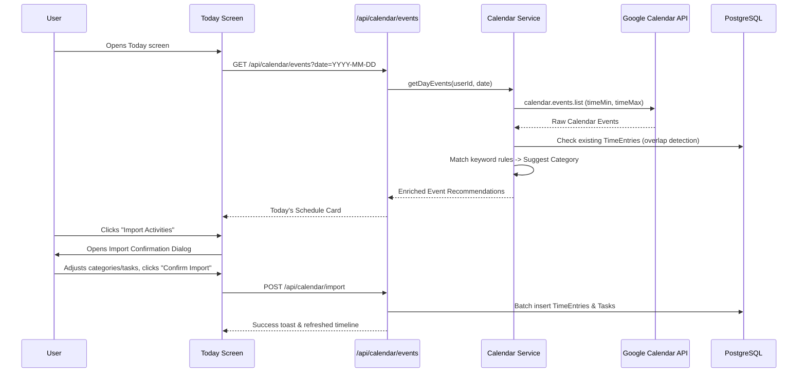

# Implementation Plan: Google Calendar Integration (Phase 1: Read & Import)

## Goal Description

Enable TETRA to connect to **Google Calendar** to read employee meetings, trainings, and scheduled events, suggest appropriate TETRA tracking categories based on intelligent keyword rules, and allow 1-click review and import into TETRA's daily activity timeline.

```text
       Google Calendar
              │
              ▼
   Meetings, Events, Training
              │
              ▼
            TETRA
           ╱     ╲
          ▼       ▼
    Time Tracker  Google Sheets
```

### Core Value
Employees frequently spend 1–3 hours daily in calendar-scheduled meetings and training sessions. Rather than manually re-entering these into TETRA, TETRA surfaces the day's schedule, suggests the right category (e.g., `Daily Standup` → `Meeting`, `Docker Workshop` → `Training`), and imports reviewed entries directly into the day's timeline.

---

## User Review Required

> [!IMPORTANT]
> **OAuth Scope Requirement:**
> Reading Google Calendar requires adding `https://www.googleapis.com/auth/calendar.readonly` to the NextAuth Google Provider scopes in `src/server/auth.ts`.
> - Users who sign in with Google will grant read-only access to their calendar.
> - For local development / offline testing without a live Google Cloud client, a mock calendar provider and mock events are provided so all features are 100% testable and operable in dev mode.

> [!NOTE]
> **Confirm Before Import (User Principle):**
> Per TETRA principles and your explicit instructions, calendar events are **never written silently**. They appear as recommendations in a **Today's Schedule** widget, and the user explicitly confirms or adjusts categories and times in a preview dialog before entries are added to the timeline.

---

## Architecture & Data Flow



---

## Proposed Changes

### Database & Schema Layer

#### [MODIFY] `src/server/db/schema.ts`
Add the `calendarConfigs` table to store user calendar preferences and custom category keyword rules:

```typescript
export const calendarConfigs = pgTable("calendar_configs", {
  id: uuid("id").defaultRandom().primaryKey(),
  userId: uuid("user_id")
    .notNull()
    .references(() => users.id, { onDelete: "cascade" }),
  calendarId: text("calendar_id").notNull().default("primary"),
  calendarName: text("calendar_name").notNull().default("Primary"),
  syncEnabled: boolean("sync_enabled").notNull().default(true),
  categoryRules: jsonb("category_rules"),
  lastSyncAt: timestamp("last_sync_at", { withTimezone: true, mode: "date" }),
  createdAt: timestamp("created_at", { withTimezone: true, mode: "date" })
    .notNull()
    .defaultNow(),
  updatedAt: timestamp("updated_at", { withTimezone: true, mode: "date" })
    .notNull()
    .defaultNow(),
});
```

---

### Google Auth & Client Layer

#### [MODIFY] `src/server/auth.ts`
Add the read-only calendar scope to Google OAuth parameters:
```typescript
scope: "openid email profile https://www.googleapis.com/auth/spreadsheets https://www.googleapis.com/auth/calendar.readonly",
```

#### [NEW] `src/features/calendar-sync/google.ts`
Google Calendar API client construction (mirroring `sheets-sync/google.ts`):
- `getCalendarClient(options: { userId?: string; accessToken?: string })`: Returns authenticated `calendar_v3.Calendar`.
- `listUserCalendars(userId: string)`: Fetches available calendars (Primary, Work, etc.).
- `fetchCalendarEvents(options: { userId: string; calendarId: string; start: Date; end: Date; timezone: string })`: Reads events in interval.

---

### Feature Domain & Rules Layer

#### [NEW] `src/features/calendar-sync/rules.ts`
Intelligent category classification rules with word-boundary matching:
```typescript
export interface CategoryRule {
  categoryKey: string;
  categoryName: string;
  keywords: string[];
}

export const DEFAULT_CATEGORY_RULES: CategoryRule[] = [
  {
    categoryKey: "meeting",
    categoryName: "Meeting",
    keywords: ["meeting", "standup", "sync", "catchup", "discussion", "huddle", "1:1", "one-on-one", "briefing", "retrospective", "demo"],
  },
  {
    categoryKey: "training",
    categoryName: "Training",
    keywords: ["training", "course", "learning", "workshop", "webinar", "onboarding", "tutorial", "class"],
  },
  {
    categoryKey: "research",
    categoryName: "Research",
    keywords: ["research", "investigation", "analysis", "spike", "exploration", "study"],
  },
  {
    categoryKey: "website_management",
    categoryName: "Website Management",
    keywords: ["website", "portal", "frontend", "backend", "api", "web", "cms", "ui", "ux"],
  },
  {
    categoryKey: "cyber_security",
    categoryName: "Cyber Security",
    keywords: ["security", "audit", "cyber", "vulnerability", "cve", "patching", "soc", "compliance"],
  },
  {
    categoryKey: "technology_innovation",
    categoryName: "Technology Optimization & Innovation",
    keywords: ["optimization", "automation", "n8n", "ai", "machine learning", "workflow", "innovation"],
  },
  {
    categoryKey: "infrastructure_management",
    categoryName: "Infrastructure Management",
    keywords: ["infrastructure", "devops", "server", "docker", "deploy", "kubernetes", "aws", "cloud", "database"],
  },
  {
    categoryKey: "other_tasks",
    categoryName: "Other Tasks",
    keywords: ["admin", "email", "ticket", "support", "misc"],
  },
];

export function matchCategory(title: string, description?: string | null, customRules?: CategoryRule[]): string {
  const rules = customRules ?? DEFAULT_CATEGORY_RULES;
  const text = `${title} ${description ?? ""}`.toLowerCase();

  for (const rule of rules) {
    for (const kw of rule.keywords) {
      const regex = new RegExp(`\\b${kw}\\b`, "i");
      if (regex.test(text)) {
        return rule.categoryKey;
      }
    }
  }
  return "other_tasks";
}
```

#### [NEW] `src/features/calendar-sync/domain.ts`
Pure domain transforms:
- Convert Google Calendar event items into `CalendarEventSuggestionDTO`.
- Compute event start/end, duration in minutes, zoned clock format (`09:00 - 09:30`).
- Overlap detection against existing `TimeEntryDTO` records for that day.
- Unit-testable without database or Google API.

#### [NEW] `src/features/calendar-sync/service.ts`
Core calendar service:
- `getCalendarSchedule(userId: string, dayKey: string, tz: string)`: Fetches events, matches categories, checks overlaps, returns suggestions.
- `importCalendarEvents(userId: string, input: ImportEventsInput)`: Batch-creates tasks (if new) and completed `timeEntries` with start/end timestamps and notes.
- `getCalendarConfig(userId: string)`: Gets or defaults calendar settings.
- `updateCalendarConfig(userId: string, config: Partial<CalendarConfig>)`: Updates calendar ID and rules.

#### [NEW] `src/features/calendar-sync/domain.test.ts`
Unit tests verifying:
- Title keyword matching across all 8 standard categories.
- Overlap detection with existing TETRA timeline entries.
- Duration and timezone calculations.
- Handling of all-day events vs. timed events.

---

### API Route Layer

#### [NEW] `src/app/api/calendar/events/route.ts`
- `GET`: Returns `{ events: CalendarEventSuggestionDTO[], hasGoogleAuth: boolean }` for a given `?date=YYYY-MM-DD`.

#### [NEW] `src/app/api/calendar/import/route.ts`
- `POST`: Validates payload with Zod, creates entries in DB, returns created entries.

#### [NEW] `src/app/api/calendar/config/route.ts`
- `GET`: Returns current calendar config and available calendar list.
- `POST`: Updates calendar config (chosen calendar ID, rules).

---

### UI Components Layer

#### [NEW] `src/components/today/calendar-schedule-card.tsx`
Morning schedule widget mounted on the Today screen (DESIGN.md layout):
- Warm greeting: `"☀️ Good morning, [User]"`
- Schedule timeline preview showing upcoming meetings & events for the day.
- Category badge preview next to each event.
- Call to action: `[ Import Calendar Activities ]` (with event count badge).
- Dismissable / collapsible if user has already reviewed.

#### [NEW] `src/components/today/import-calendar-dialog.tsx`
Interactive review modal:
- Lists each detected event with:
  - Checkbox (selected by default; unselected if overlapping).
  - Time range (`09:00 - 09:30`).
  - Task name input (prefilled with event title).
  - Category dropdown (prefilled with auto-detected category, editable).
  - Overlap warning badge if conflicting with an existing timeline entry.
- Action buttons: `[ Cancel ]` and `[ Import X Activities ]`.

#### [NEW] `src/components/settings/calendar-settings-card.tsx`
Google Calendar card in `/settings`:
- Connection status indicator (Google Connected / Disconnected).
- Calendar dropdown selector (`Primary`, `Work`, etc.).
- Keyword rules viewer / quick customization.
- Test connection button.

---

## Verification Plan

### Automated Tests
1. **Unit tests for calendar domain & keyword rules**:
   ```bash
   pnpm test src/features/calendar-sync/domain.test.ts
   ```
2. **Full test suite**:
   ```bash
   pnpm test
   ```
3. **Lint & Typecheck**:
   ```bash
   pnpm lint
   pnpm typecheck
   ```
4. **Build verification**:
   ```bash
   pnpm build
   ```

### Manual Verification
1. **Settings Configuration**:
   - Navigate to `/settings` and verify the Google Calendar section appears.
   - Verify calendar selector shows `Primary` by default and allows switching.
2. **Schedule Preview on Today Screen**:
   - Open Today screen and verify the "Today's Schedule" card displays scheduled events with detected categories.
3. **Interactive Import**:
   - Click "Import Calendar Activities".
   - Change a suggested category or edit the task title in the dialog.
   - Click "Import" and verify entries appear immediately on Today's timeline.
   - Verify duration and totals update automatically.
