# TETRA E2E Visual Test Results Gallery

This gallery documents the end-to-end visual captures executed across all TETRA views, workflows, and viewports.

**Total visual captures:** 39 screenshots  
**Generated on:** Wed, 09 Sep 2026 19:05:41 GMT

## Table of Contents

- [Authentication & Onboarding](#authentication-onboarding)
- [Today & Attendance](#today-attendance)
- [Onboarding & Assistance](#onboarding-assistance)
- [Activity Tracking](#activity-tracking)
- [Confirmations & Safety](#confirmations-safety)
- [Timeline & History](#timeline-history)
- [Tasks & Favorites](#tasks-favorites)
- [Reports & Sync](#reports-sync)
- [Dashboard Analytics](#dashboard-analytics)
- [Settings & Integrations](#settings-integrations)
- [Shortcuts & Accessibility](#shortcuts-accessibility)
- [Resilience & Network](#resilience-network)
- [Mobile Experience](#mobile-experience)

---

## Authentication & Onboarding

| Screenshot | Description | Viewport | File Path |
| :--- | :--- | :---: | :--- |
| **01-login-screen.png** | Login screen with Google Auth and Dev Access | `1440x900` | [desktop/01-login-screen.png](./desktop/01-login-screen.png) |
| **31-sign-out-return-to-login.png** | Sign out transition successfully returning user to login screen | `1440x900` | [desktop/31-sign-out-return-to-login.png](./desktop/31-sign-out-return-to-login.png) |

### Login screen with Google Auth and Dev Access

> Viewport: `1440x900` · Relative path: `desktop/01-login-screen.png`

### Sign out transition successfully returning user to login screen

> Viewport: `1440x900` · Relative path: `desktop/31-sign-out-return-to-login.png`

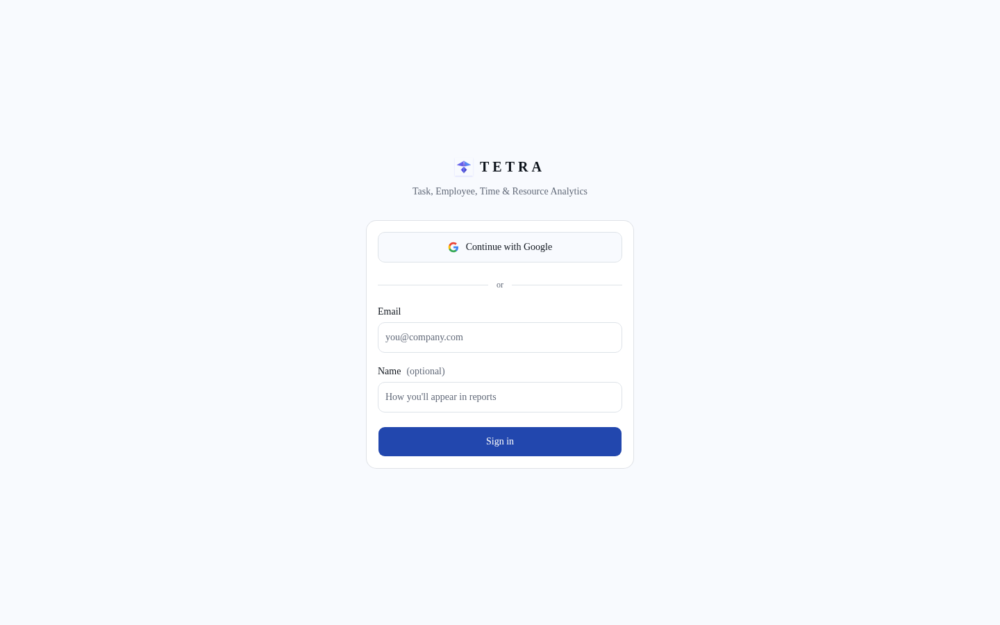

## Today & Attendance

| Screenshot | Description | Viewport | File Path |
| :--- | :--- | :---: | :--- |
| **02-today-not-clocked-in.png** | Today screen before clocking in (calm empty state) | `1440x900` | [desktop/02-today-not-clocked-in.png](./desktop/02-today-not-clocked-in.png) |
| **05-today-clocked-in.png** | Today screen clocked in and ready for tasks | `1440x900` | [desktop/05-today-clocked-in.png](./desktop/05-today-clocked-in.png) |
| **09-break-active.png** | Today screen with active break indicator | `1440x900` | [desktop/09-break-active.png](./desktop/09-break-active.png) |
| **12-today-done-concluded.png** | Today screen after concluding the work day | `1440x900` | [desktop/12-today-done-concluded.png](./desktop/12-today-done-concluded.png) |
| **18-today-quick-start.png** | Today screen featuring Quick Start chips from favorites | `1440x900` | [desktop/18-today-quick-start.png](./desktop/18-today-quick-start.png) |

### Today screen before clocking in (calm empty state)

> Viewport: `1440x900` · Relative path: `desktop/02-today-not-clocked-in.png`

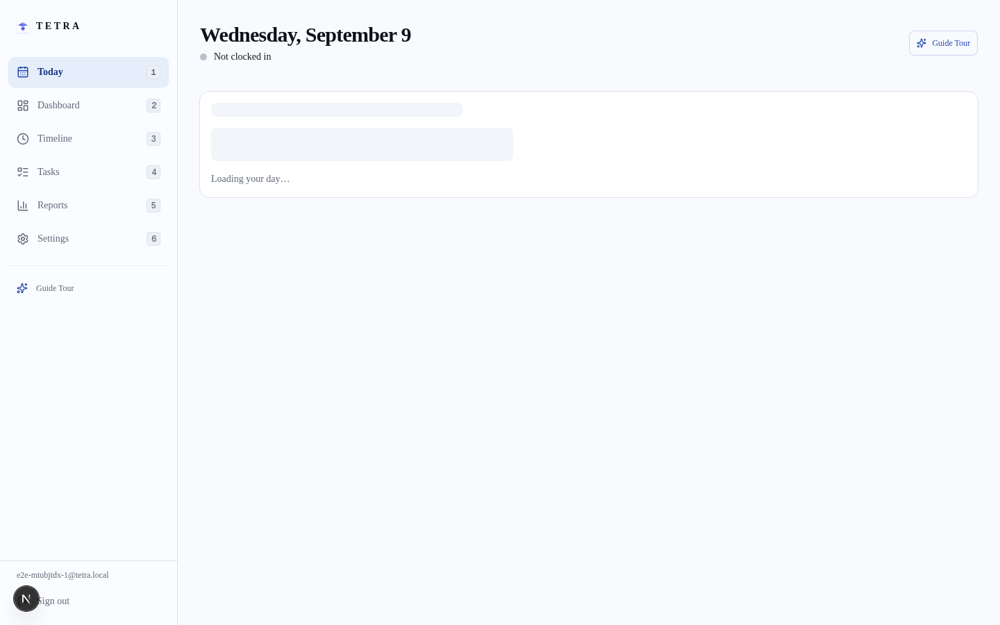

### Today screen clocked in and ready for tasks

> Viewport: `1440x900` · Relative path: `desktop/05-today-clocked-in.png`

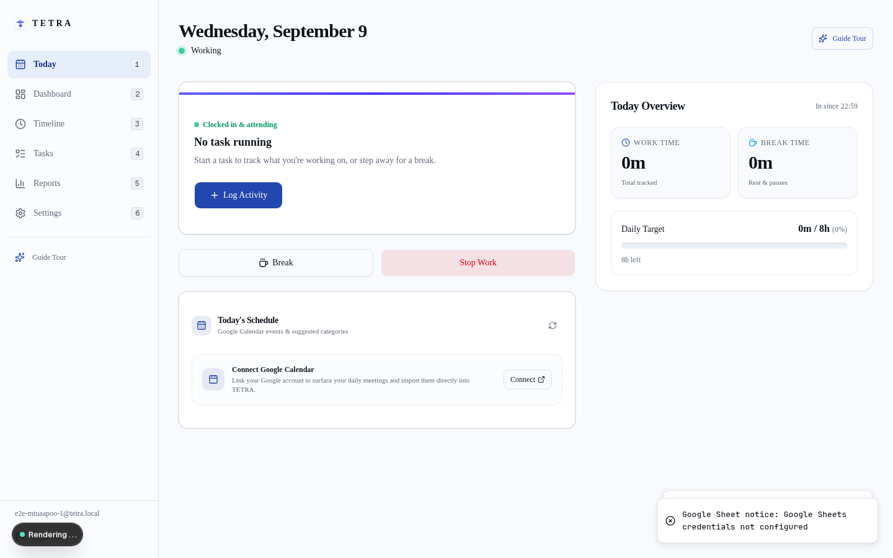

### Today screen with active break indicator

> Viewport: `1440x900` · Relative path: `desktop/09-break-active.png`

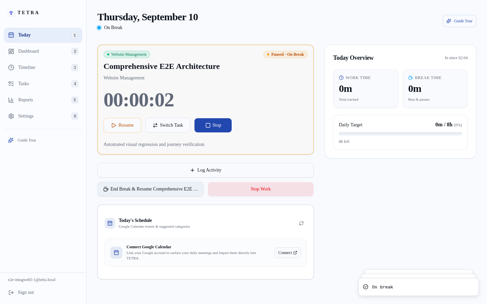

### Today screen after concluding the work day

> Viewport: `1440x900` · Relative path: `desktop/12-today-done-concluded.png`

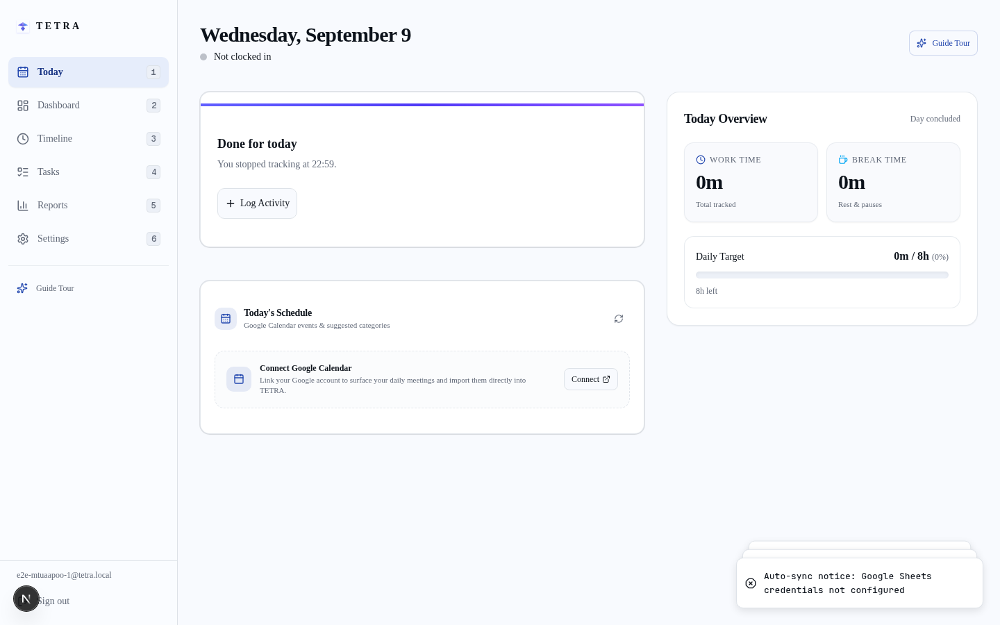

### Today screen featuring Quick Start chips from favorites

> Viewport: `1440x900` · Relative path: `desktop/18-today-quick-start.png`

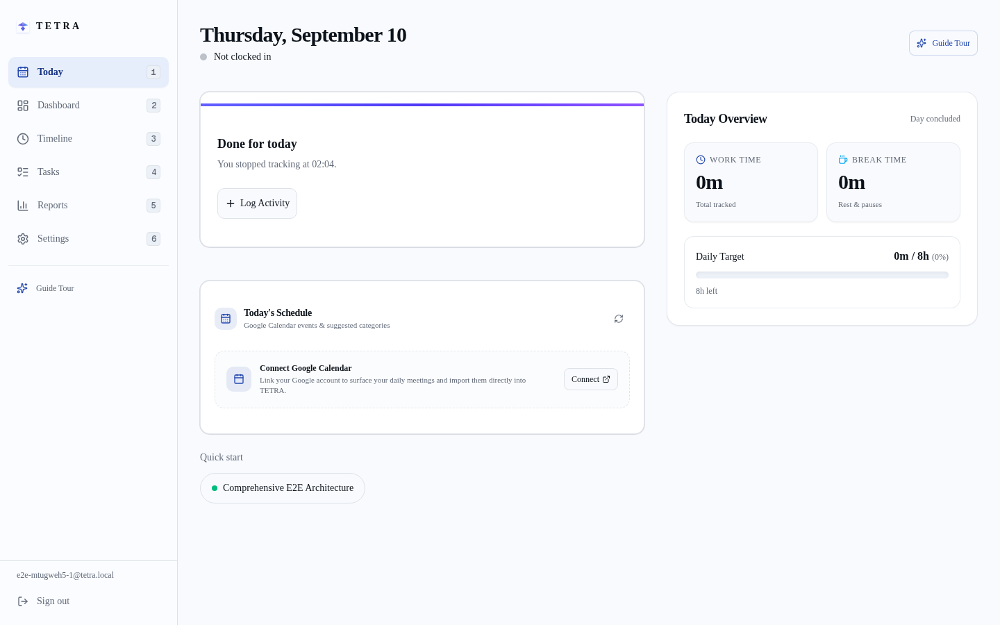

## Onboarding & Assistance

| Screenshot | Description | Viewport | File Path |
| :--- | :--- | :---: | :--- |
| **03-guided-tour-spotlight-step1.png** | Guided tour step 1 spotlight highlighting Today hero | `1440x900` | [desktop/03-guided-tour-spotlight-step1.png](./desktop/03-guided-tour-spotlight-step1.png) |
| **04-guided-tour-spotlight-step2.png** | Guided tour step 2 spotlight highlighting Today overview | `1440x900` | [desktop/04-guided-tour-spotlight-step2.png](./desktop/04-guided-tour-spotlight-step2.png) |

### Guided tour step 1 spotlight highlighting Today hero

> Viewport: `1440x900` · Relative path: `desktop/03-guided-tour-spotlight-step1.png`

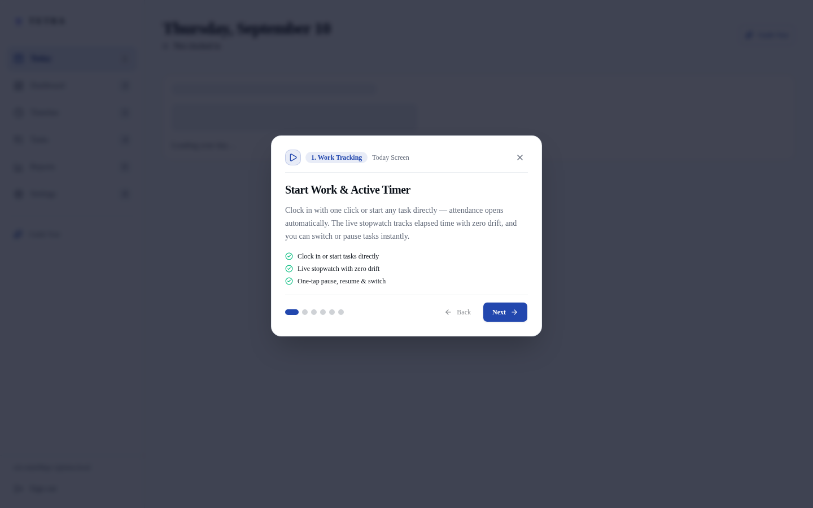

### Guided tour step 2 spotlight highlighting Today overview

> Viewport: `1440x900` · Relative path: `desktop/04-guided-tour-spotlight-step2.png`

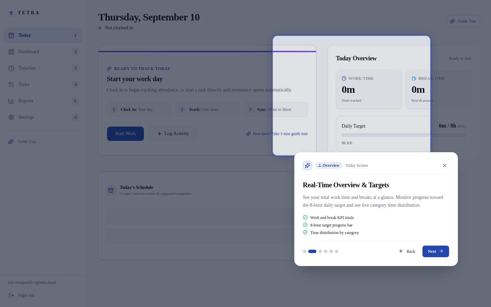

## Activity Tracking

| Screenshot | Description | Viewport | File Path |
| :--- | :--- | :---: | :--- |
| **06-start-task-dialog.png** | Start task modal dialog with category, task name, and notes | `1440x900` | [desktop/06-start-task-dialog.png](./desktop/06-start-task-dialog.png) |
| **07-task-active-running.png** | Today screen with live active task stopwatch running | `1440x900` | [desktop/07-task-active-running.png](./desktop/07-task-active-running.png) |
| **08-task-paused.png** | Today screen with paused task timer | `1440x900` | [desktop/08-task-paused.png](./desktop/08-task-paused.png) |

### Start task modal dialog with category, task name, and notes

> Viewport: `1440x900` · Relative path: `desktop/06-start-task-dialog.png`

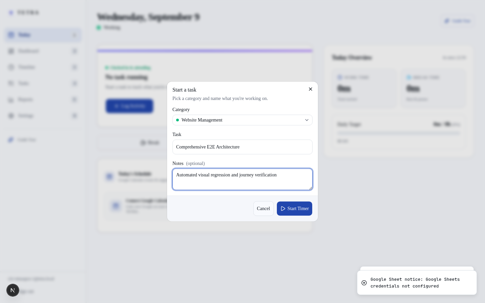

### Today screen with live active task stopwatch running

> Viewport: `1440x900` · Relative path: `desktop/07-task-active-running.png`

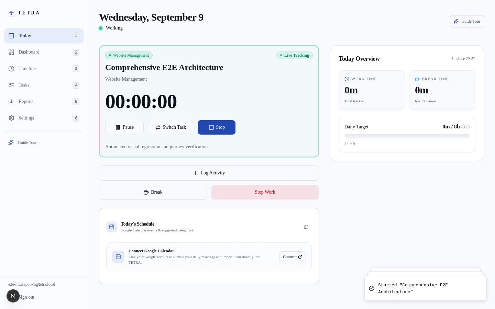

### Today screen with paused task timer

> Viewport: `1440x900` · Relative path: `desktop/08-task-paused.png`

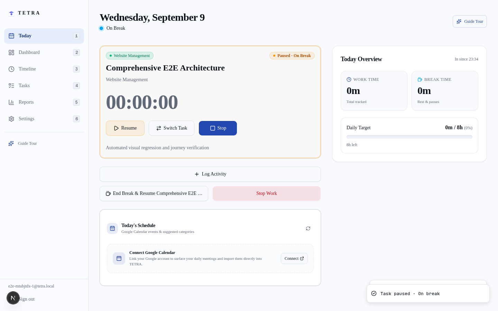

## Confirmations & Safety

| Screenshot | Description | Viewport | File Path |
| :--- | :--- | :---: | :--- |
| **10-stop-task-confirm-modal.png** | Stop task confirmation safety modal | `1440x900` | [desktop/10-stop-task-confirm-modal.png](./desktop/10-stop-task-confirm-modal.png) |
| **11-stop-work-confirm-modal.png** | Stop work for today confirmation modal | `1440x900` | [desktop/11-stop-work-confirm-modal.png](./desktop/11-stop-work-confirm-modal.png) |

### Stop task confirmation safety modal

> Viewport: `1440x900` · Relative path: `desktop/10-stop-task-confirm-modal.png`

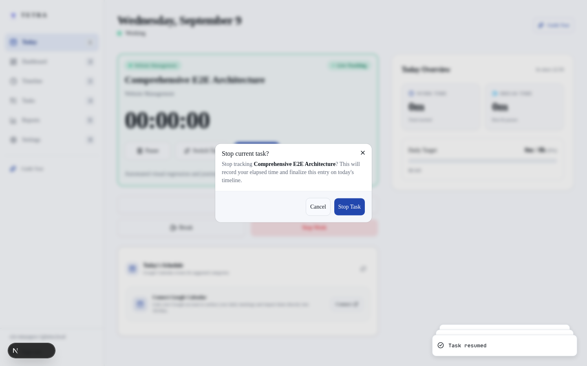

### Stop work for today confirmation modal

> Viewport: `1440x900` · Relative path: `desktop/11-stop-work-confirm-modal.png`

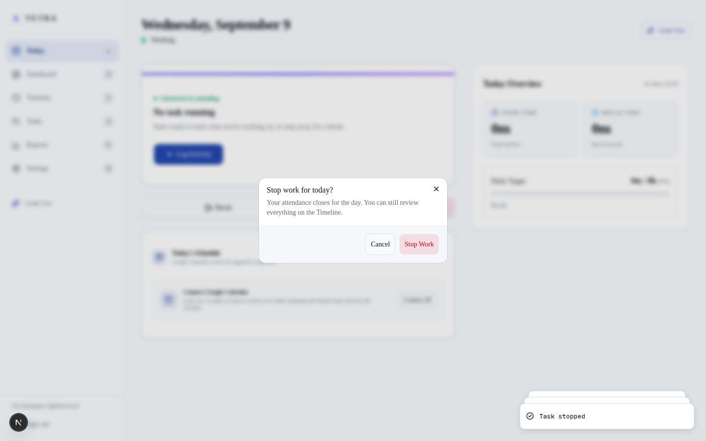

## Timeline & History

| Screenshot | Description | Viewport | File Path |
| :--- | :--- | :---: | :--- |
| **13-timeline-view.png** | Timeline view displaying chronological activity and breaks | `1440x900` | [desktop/13-timeline-view.png](./desktop/13-timeline-view.png) |
| **14-timeline-add-entry-dialog.png** | Timeline modal to manually add missing activity or break | `1440x900` | [desktop/14-timeline-add-entry-dialog.png](./desktop/14-timeline-add-entry-dialog.png) |
| **15-timeline-split-dialog.png** | Timeline split activity dialog | `1440x900` | [desktop/15-timeline-split-dialog.png](./desktop/15-timeline-split-dialog.png) |

### Timeline view displaying chronological activity and breaks

> Viewport: `1440x900` · Relative path: `desktop/13-timeline-view.png`

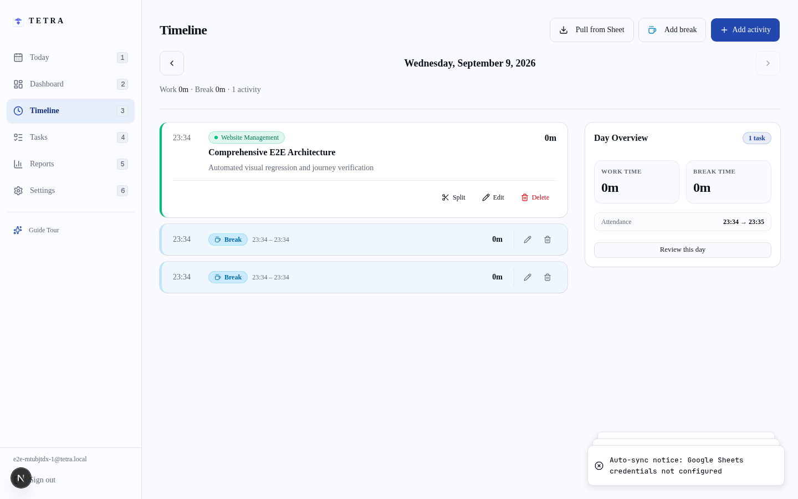

### Timeline modal to manually add missing activity or break

> Viewport: `1440x900` · Relative path: `desktop/14-timeline-add-entry-dialog.png`

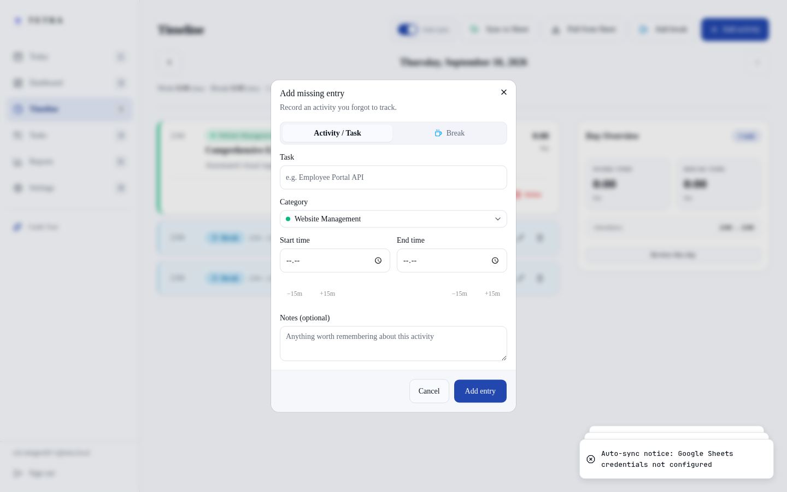

### Timeline split activity dialog

> Viewport: `1440x900` · Relative path: `desktop/15-timeline-split-dialog.png`

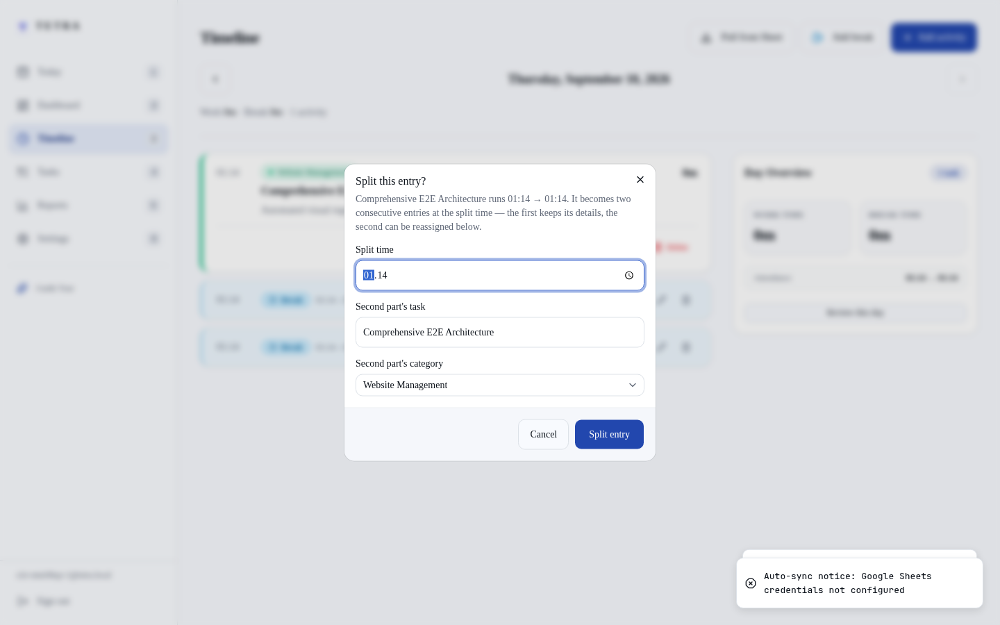

## Tasks & Favorites

| Screenshot | Description | Viewport | File Path |
| :--- | :--- | :---: | :--- |
| **16-tasks-view.png** | Tasks view listing recent tasks with category themes | `1440x900` | [desktop/16-tasks-view.png](./desktop/16-tasks-view.png) |
| **17-tasks-favorited.png** | Tasks view with task starred as favorite | `1440x900` | [desktop/17-tasks-favorited.png](./desktop/17-tasks-favorited.png) |

### Tasks view listing recent tasks with category themes

> Viewport: `1440x900` · Relative path: `desktop/16-tasks-view.png`

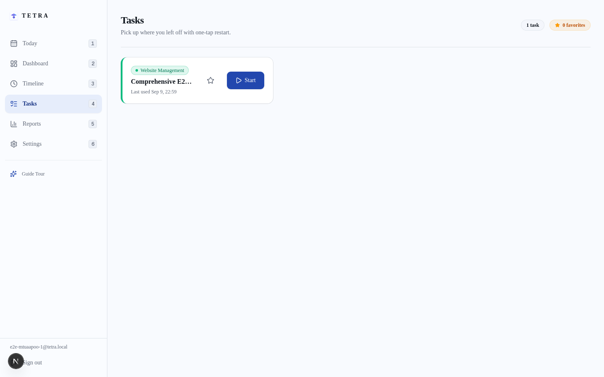

### Tasks view with task starred as favorite

> Viewport: `1440x900` · Relative path: `desktop/17-tasks-favorited.png`

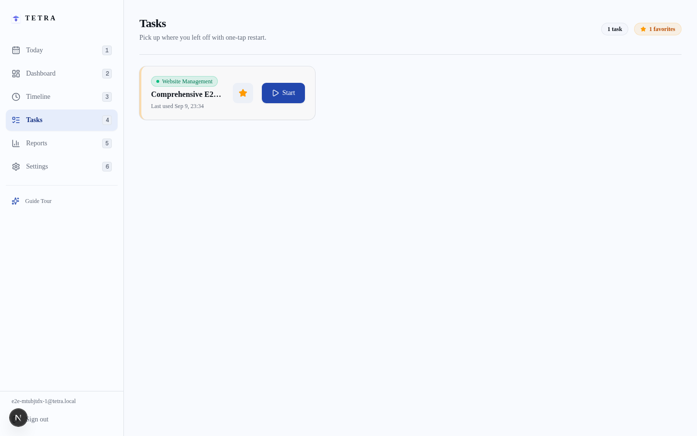

## Reports & Sync

| Screenshot | Description | Viewport | File Path |
| :--- | :--- | :---: | :--- |
| **19-reports-daily-review.png** | Daily Review screen showing totals and category breakdown | `1440x900` | [desktop/19-reports-daily-review.png](./desktop/19-reports-daily-review.png) |
| **20-reports-reviewed-state.png** | Daily Review with Reviewed status badge and sync actions | `1440x900` | [desktop/20-reports-reviewed-state.png](./desktop/20-reports-reviewed-state.png) |
| **21-sync-to-file-dialog.png** | Sync to file modal dialog for manual spreadsheet export | `1440x900` | [desktop/21-sync-to-file-dialog.png](./desktop/21-sync-to-file-dialog.png) |
| **22-reports-weekly-summary.png** | Weekly report summary with day cards and weekly targets | `1440x900` | [desktop/22-reports-weekly-summary.png](./desktop/22-reports-weekly-summary.png) |
| **23-reports-monthly-summary.png** | Monthly report summary with monthly hours and weekly slices | `1440x900` | [desktop/23-reports-monthly-summary.png](./desktop/23-reports-monthly-summary.png) |

### Daily Review screen showing totals and category breakdown

> Viewport: `1440x900` · Relative path: `desktop/19-reports-daily-review.png`

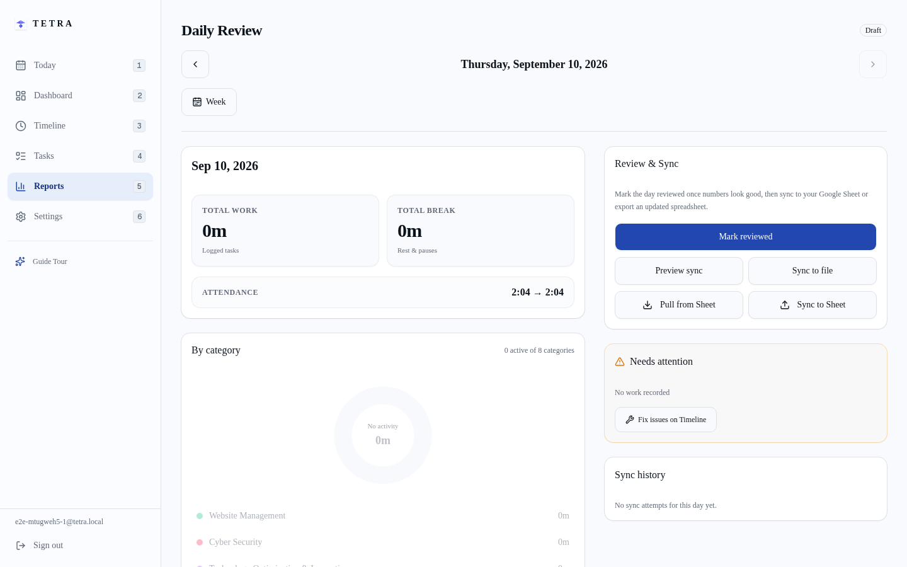

### Daily Review with Reviewed status badge and sync actions

> Viewport: `1440x900` · Relative path: `desktop/20-reports-reviewed-state.png`

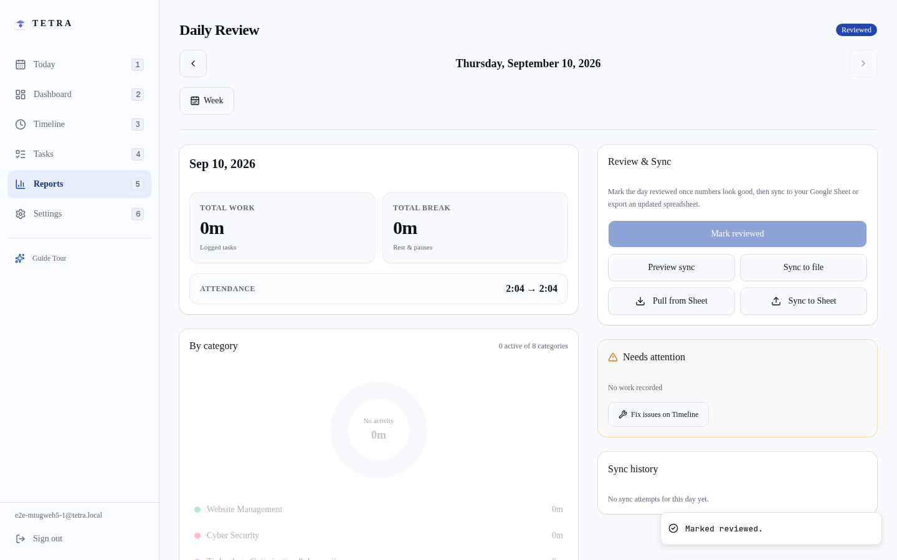

### Sync to file modal dialog for manual spreadsheet export

> Viewport: `1440x900` · Relative path: `desktop/21-sync-to-file-dialog.png`

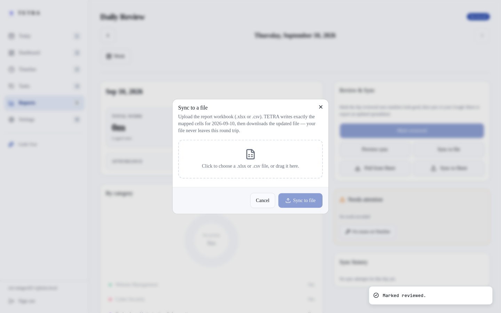

### Weekly report summary with day cards and weekly targets

> Viewport: `1440x900` · Relative path: `desktop/22-reports-weekly-summary.png`

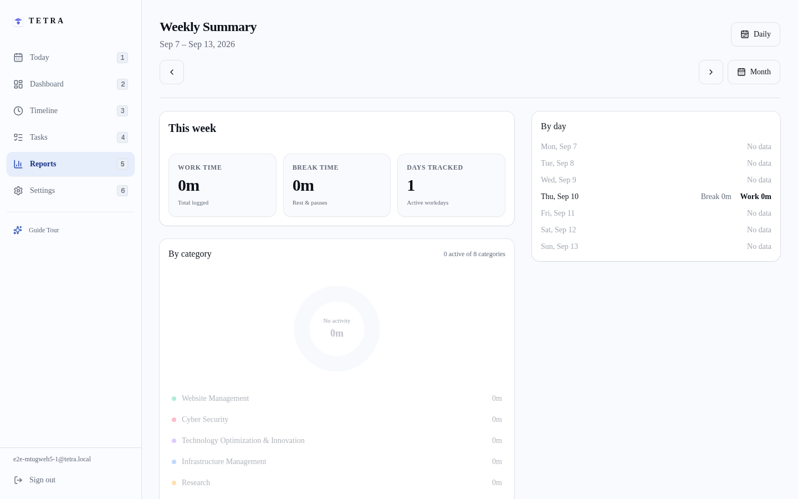

### Monthly report summary with monthly hours and weekly slices

> Viewport: `1440x900` · Relative path: `desktop/23-reports-monthly-summary.png`

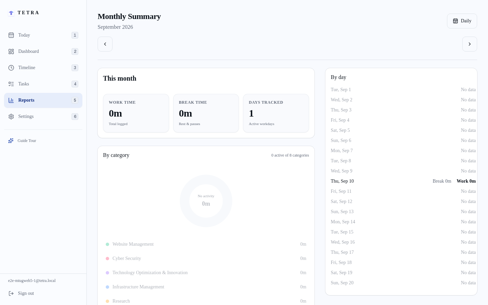

## Dashboard Analytics

| Screenshot | Description | Viewport | File Path |
| :--- | :--- | :---: | :--- |
| **24-dashboard-overview-tab.png** | Dashboard Overview tab with progress KPI cards | `1440x900` | [desktop/24-dashboard-overview-tab.png](./desktop/24-dashboard-overview-tab.png) |
| **25-dashboard-daily-tab.png** | Dashboard Daily progress section with categories distribution | `1440x900` | [desktop/25-dashboard-daily-tab.png](./desktop/25-dashboard-daily-tab.png) |
| **26-dashboard-weekly-tab.png** | Dashboard Weekly progress section and personal report table | `1440x900` | [desktop/26-dashboard-weekly-tab.png](./desktop/26-dashboard-weekly-tab.png) |
| **27-dashboard-monthly-tab.png** | Dashboard Monthly progress breakdown by week slices | `1440x900` | [desktop/27-dashboard-monthly-tab.png](./desktop/27-dashboard-monthly-tab.png) |

### Dashboard Overview tab with progress KPI cards

> Viewport: `1440x900` · Relative path: `desktop/24-dashboard-overview-tab.png`

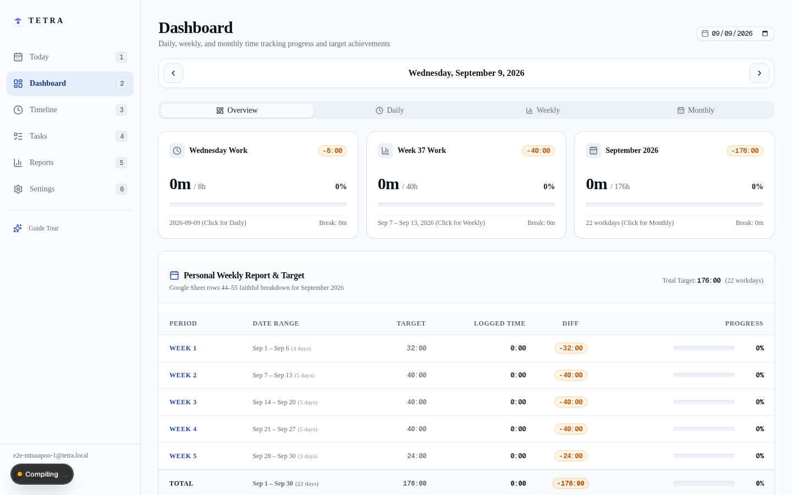

### Dashboard Daily progress section with categories distribution

> Viewport: `1440x900` · Relative path: `desktop/25-dashboard-daily-tab.png`

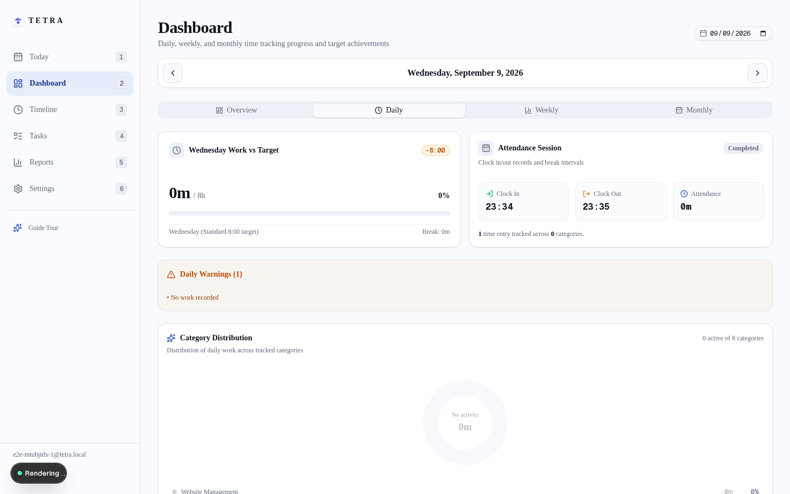

### Dashboard Weekly progress section and personal report table

> Viewport: `1440x900` · Relative path: `desktop/26-dashboard-weekly-tab.png`

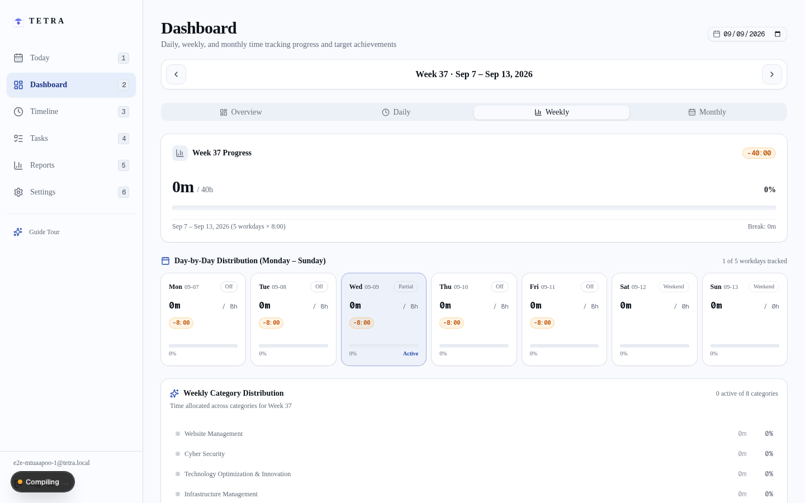

### Dashboard Monthly progress breakdown by week slices

> Viewport: `1440x900` · Relative path: `desktop/27-dashboard-monthly-tab.png`

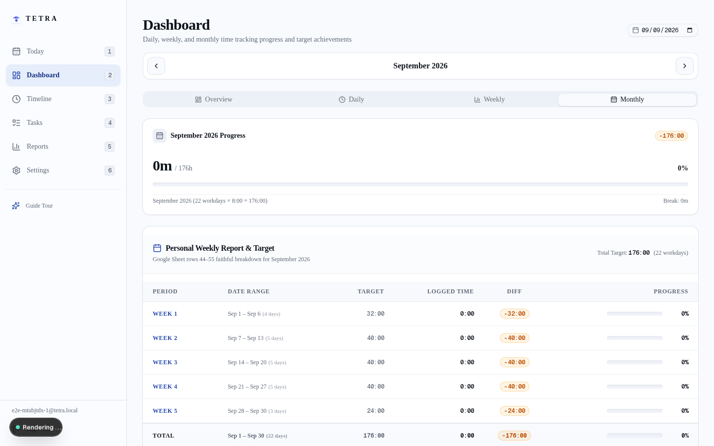

## Settings & Integrations

| Screenshot | Description | Viewport | File Path |
| :--- | :--- | :---: | :--- |
| **28-settings-view.png** | Settings screen with Google Sheets mappings and Calendar sync | `1440x900` | [desktop/28-settings-view.png](./desktop/28-settings-view.png) |

### Settings screen with Google Sheets mappings and Calendar sync

> Viewport: `1440x900` · Relative path: `desktop/28-settings-view.png`

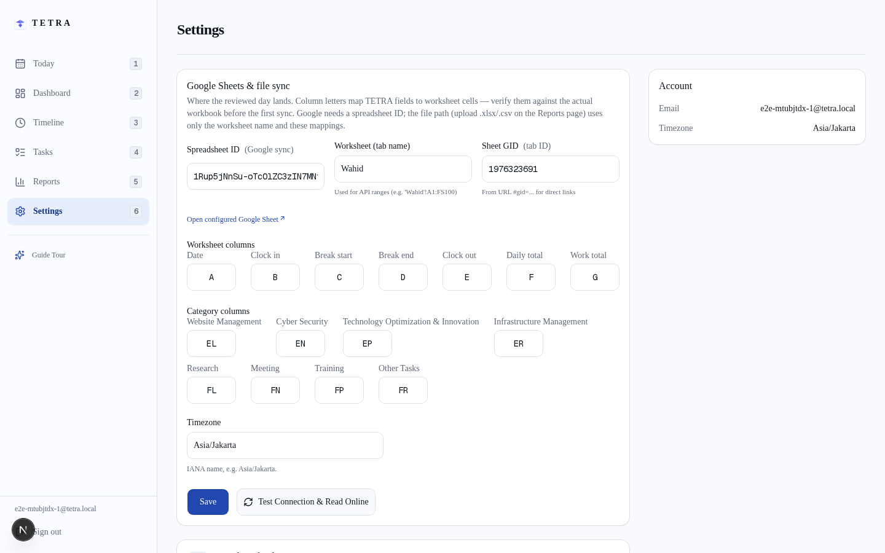

## Shortcuts & Accessibility

| Screenshot | Description | Viewport | File Path |
| :--- | :--- | :---: | :--- |
| **29-keyboard-shortcuts-dialog.png** | Keyboard shortcuts modal dialog (? key) | `1440x900` | [desktop/29-keyboard-shortcuts-dialog.png](./desktop/29-keyboard-shortcuts-dialog.png) |

### Keyboard shortcuts modal dialog (? key)

> Viewport: `1440x900` · Relative path: `desktop/29-keyboard-shortcuts-dialog.png`

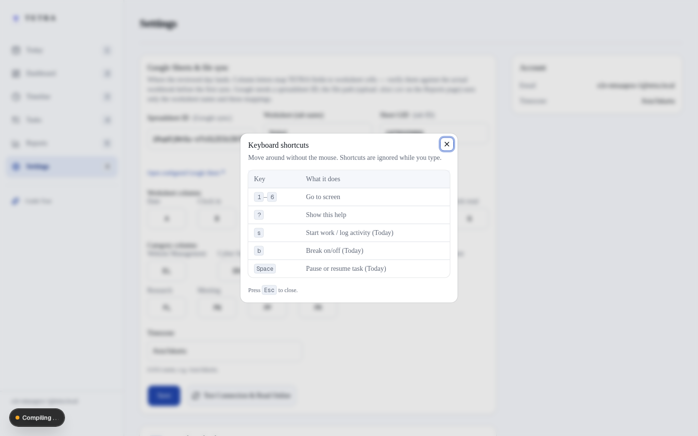

## Resilience & Network

| Screenshot | Description | Viewport | File Path |
| :--- | :--- | :---: | :--- |
| **30-offline-banner.png** | Offline banner signaling connection loss with state preservation | `1440x900` | [desktop/30-offline-banner.png](./desktop/30-offline-banner.png) |

### Offline banner signaling connection loss with state preservation

> Viewport: `1440x900` · Relative path: `desktop/30-offline-banner.png`

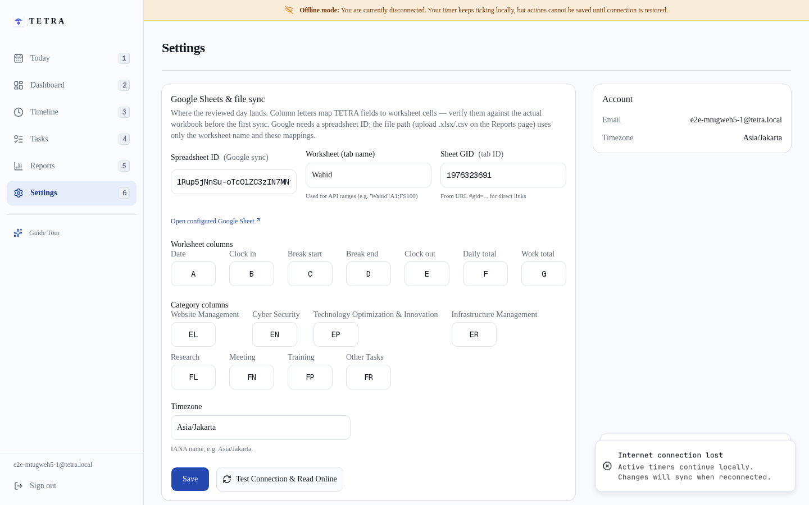

## Mobile Experience

| Screenshot | Description | Viewport | File Path |
| :--- | :--- | :---: | :--- |
| **01-mobile-login.png** | Mobile login screen with touch-friendly controls | `390x844` | [mobile/01-mobile-login.png](./mobile/01-mobile-login.png) |
| **02-mobile-today-not-clocked-in.png** | Mobile Today view with touch start actions and bottom navigation | `390x844` | [mobile/02-mobile-today-not-clocked-in.png](./mobile/02-mobile-today-not-clocked-in.png) |
| **03-mobile-today-active-sticky-bar.png** | Mobile Today view with persistent sticky active-task bar | `390x844` | [mobile/03-mobile-today-active-sticky-bar.png](./mobile/03-mobile-today-active-sticky-bar.png) |
| **04-mobile-timeline.png** | Mobile Timeline view displaying compact activity items and gaps | `390x844` | [mobile/04-mobile-timeline.png](./mobile/04-mobile-timeline.png) |
| **05-mobile-dashboard.png** | Mobile Dashboard view with adaptive KPI cards and tabs | `390x844` | [mobile/05-mobile-dashboard.png](./mobile/05-mobile-dashboard.png) |
| **06-mobile-reports.png** | Mobile Daily Review view with touch-friendly sync options | `390x844` | [mobile/06-mobile-reports.png](./mobile/06-mobile-reports.png) |
| **07-mobile-tasks.png** | Mobile Tasks view with one-tap start buttons and star favorites | `390x844` | [mobile/07-mobile-tasks.png](./mobile/07-mobile-tasks.png) |
| **08-mobile-settings.png** | Mobile Settings view with responsive configuration fields | `390x844` | [mobile/08-mobile-settings.png](./mobile/08-mobile-settings.png) |

### Mobile login screen with touch-friendly controls

> Viewport: `390x844` · Relative path: `mobile/01-mobile-login.png`

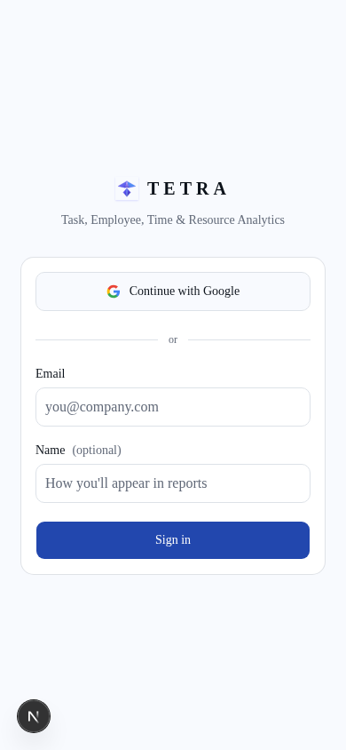

### Mobile Today view with touch start actions and bottom navigation

> Viewport: `390x844` · Relative path: `mobile/02-mobile-today-not-clocked-in.png`

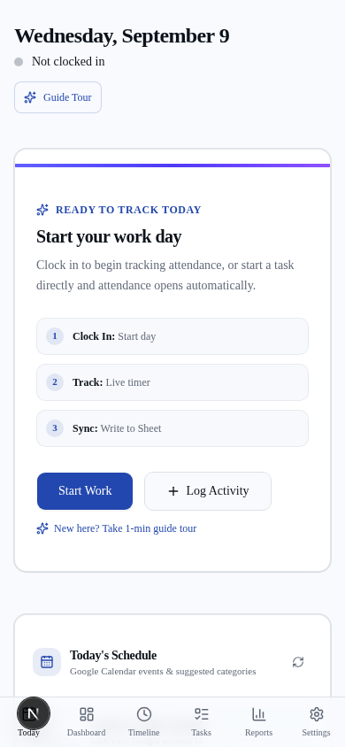

### Mobile Today view with persistent sticky active-task bar

> Viewport: `390x844` · Relative path: `mobile/03-mobile-today-active-sticky-bar.png`

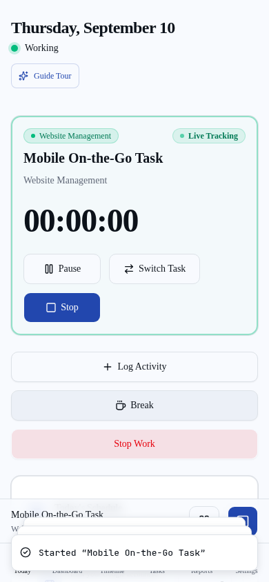

### Mobile Timeline view displaying compact activity items and gaps

> Viewport: `390x844` · Relative path: `mobile/04-mobile-timeline.png`

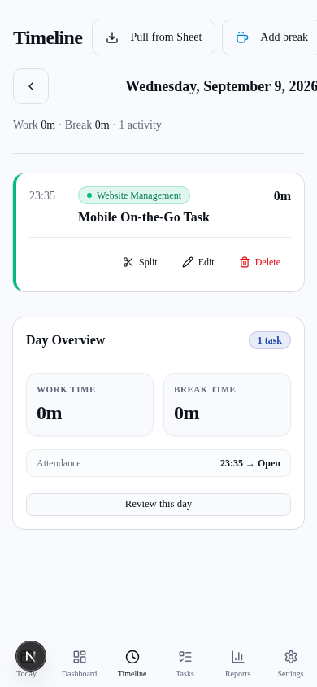

### Mobile Dashboard view with adaptive KPI cards and tabs

> Viewport: `390x844` · Relative path: `mobile/05-mobile-dashboard.png`

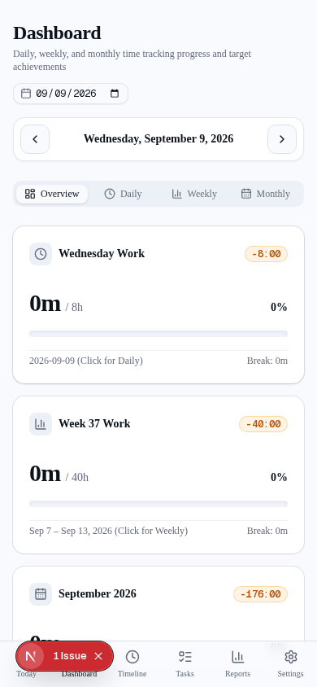

### Mobile Daily Review view with touch-friendly sync options

> Viewport: `390x844` · Relative path: `mobile/06-mobile-reports.png`

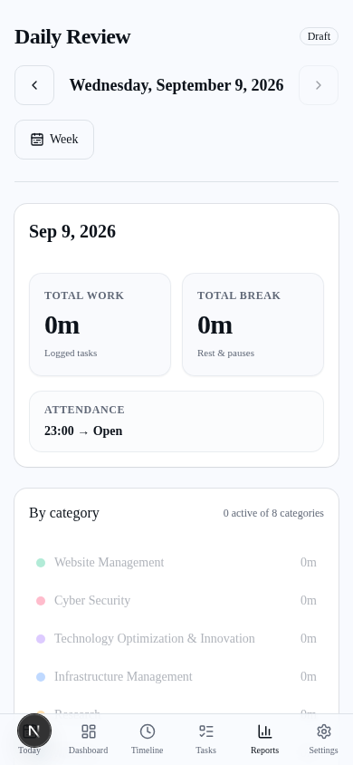

### Mobile Tasks view with one-tap start buttons and star favorites

> Viewport: `390x844` · Relative path: `mobile/07-mobile-tasks.png`

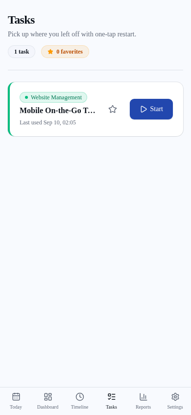

### Mobile Settings view with responsive configuration fields

> Viewport: `390x844` · Relative path: `mobile/08-mobile-settings.png`

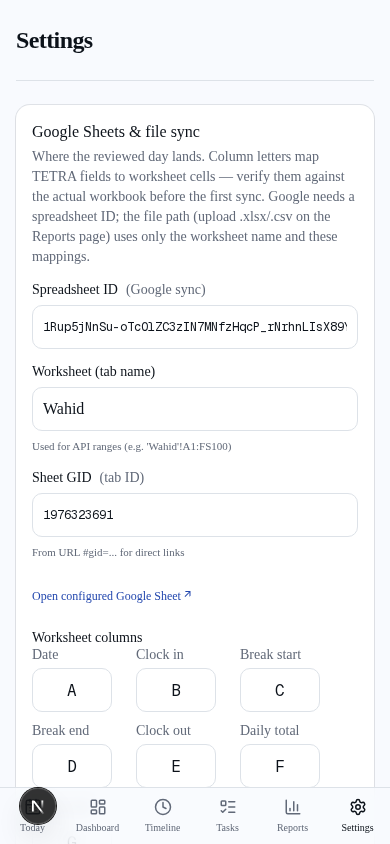

